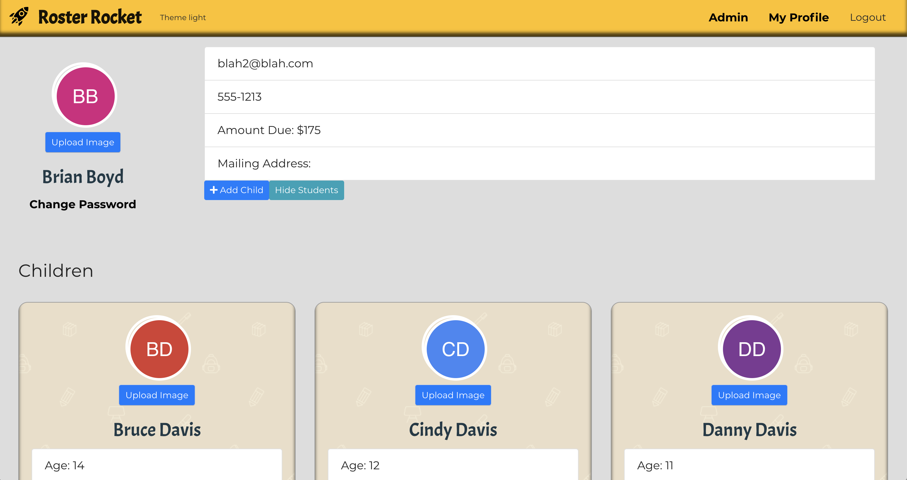

# Roster Rocket - Helping Homeschool Co-ops Launch

Click the image to view the depoyed site, or use <a href="https://project3-temp.herokuapp.com/">this link</a>.

When creating a new user for testing, use group code: 123456

# Overview
This tool gives homeschool admin teams an easy way to view class rosters, get student or parent info, and see what classes each student is registered for. It will also make collecting and managing dues easy and convenient, and gives parents an easy way to register and pay.

This was a final collaborative project for the UT Full Stack Coding Bootcamp

# Contents
## Table of Contents

- [Outline of the Problem](#Problem)
- [Business Case and Competition](#Business)
- [Our Team](#Team)
- [Screenshots and Walkthrough](#Screenshots)
- [Technologies Used](#Technologies)
- [Challenges Faced](#Challenges)
- [Links](#Links)

## Problem

In Texas alone, there are approximately 1000 homeschool co-ops. These organizations are typically run by parents who volunteer their time and efforts to make a positive learning environment for their children. 

Some of the biggest challenges for the admin team center on organizing and managing the classes and rosters. Our project will offer homeschool admin teams an easy way to manage enrollment, manage class rosters, and even track class dues.

### Real World Problems
* There is no easy way for homeschool admin teams to manage students and the classes each child is registered for. 
* Admin teams typically use a spreadsheet application to try to manage this data, but these tables can very quickly become overwhelming and messy.
* Organizing classes, registering students, and tracking payments can be incredibly time-consuming. As parent volunteers, these processes can be overwheming.
* Parents generally lack a transparent method for calculating the amount due, how to register their children for the available classes, and how to pay. 
* Typically, there is a separate treasurer who is responsible for collecting and determining dues each parent owes. 

### User Stories

As an admin, I want an easy way to organize students into available classes, see what students are registered to what classes, and track if a parent has paid their dues. I also want to have a simple way to make class roster lists of students, and track payments for each class.

As a parent, I want an easy way to sign my children up for home school co-op classes, see class info, see what classes my children are in, and I want an easy way to pay for those classes.

### [Back to Table of Contents](#Contents)

## Business

### The Market is Growing

According to <a href="https://www.nheri.org/homeschool-population-size-growing/">all research on the growth rates of homeschool trends</a>, the number of homeschoole children is growing at a tremendoius rate.  

Even with this tremendous growth, still less than 4% of the school age children in the US are homeschooled. Homeschool learning has become a viable, mainstream option for families. 

The growth rate of homeschool co-op groups is trending in the same direction. Parents are creating co-ops to suppliment learning, provide a social outlet for group learning, and to provide support and camraderie.

### Current Tools

There are tools on the market that focus on admin teams to assist with running schools and groups. Unfortunately, the current tools are ill-suited for managing smaller groups like homeschool co-ops. 
* Existing tools are too expensive
* Existing tools are far too heavy and contain unnecessary features.
* The learning curve is too steep. 

### Our Solution

Roster Rocket meets the exact needs of the small homeschool co-op market. The platform can be expanded in the future if additional features are requested. It is easy to use and will alleviate many of the challenges currently faced by these small admin teams.

### [Back to Table of Contents](#Contents)

## Team

### [Back to Table of Contents](#Contents)

## Screenshots

Admin users will be presented with an admin dashboard once logged in:

From the dashboard, they can add parents, classes, and students. They can also click on any item from the lists to see the relevant card:

Admins are presented with a modal when they click add class or student:

Parents will see their parent dashboard with a card for each child

Child Card on parent dashboard will have options to add and view classes, and pay:

### [Back to Table of Contents](#Contents)

## Technologies
Our final project using the full MERN stack (MySql, Express, React, Node). 
* Bootstrap used for formatting.
* Cloudinary used to manage image uploads and user image library.
* React-Avatar NPM tool to create avatar for uses with no image.
* Send-Grid API to send emails to users, reset password, and send parent invites. 
* React-Modal for modal popups.
* Monday.com for Project Management and collaboration

### [Back to Table of Contents](#Contents)

## Challenges

* Many to Many relationships between data
* Defining the MVP
* Scope Creep
* Implementing the new technologies

### [Back to Table of Contents](#Contents)

## Links

Github: https://github.com/kgeary/project3

Deployed: https://project3-temp.herokuapp.com/

### [Back to Table of Contents](#Contents)

## Follow the progress at
[Project 3 on heroku](https://project3-temp.herokuapp.com/)
